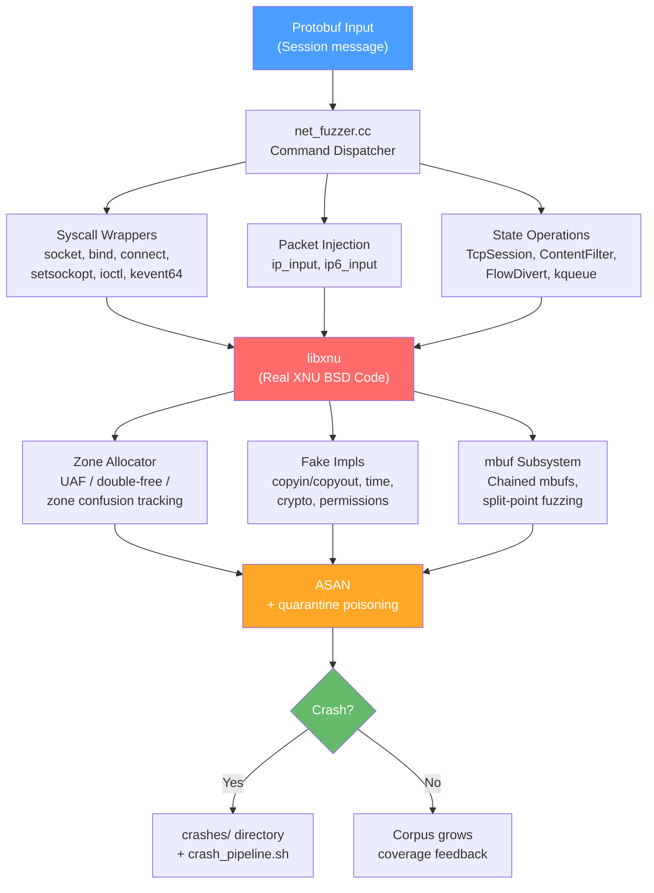
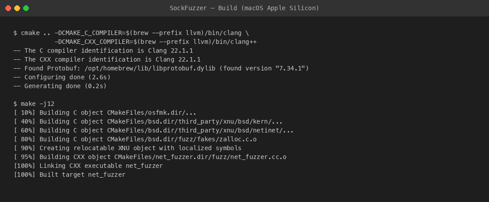
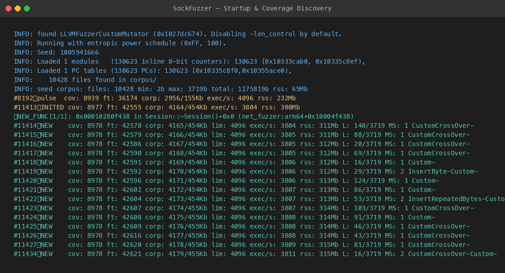
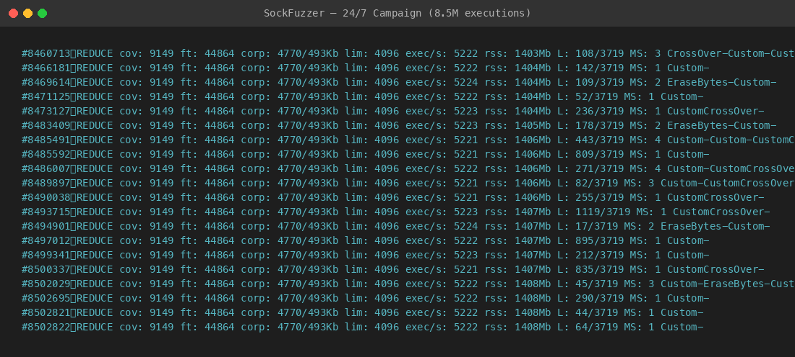
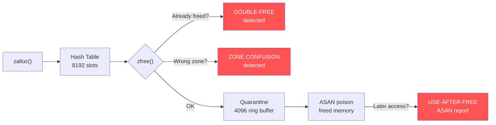

# SockFuzzer — Apple Silicon Edition

> **Based on the original [SockFuzzer](https://github.com/googleprojectzero/SockFuzzer)
> by Ned Williamson (Google Project Zero).**
>
> This fork builds on the **original CMake/libFuzzer architecture** (pre-v3) and extends
> it with Apple Silicon support, hardened kernel stubs, expanded attack surface coverage,
> and production-grade tooling. The upstream project has since moved to Bazel + Centipede;
> this fork stays on the proven CMake + libFuzzer + libprotobuf-mutator stack.

## What is SockFuzzer?

SockFuzzer compiles the **real XNU BSD networking code** into a userland library and
drives it with [libprotobuf-mutator](https://github.com/google/libprotobuf-mutator)
and [libFuzzer](https://llvm.org/docs/LibFuzzer.html). This lets you fuzz socket
syscalls, packet parsing, and ioctl handling on macOS and Linux — no VM, no kernel
debug setup, no jailbreak needed.

## Architecture



## In Action

**Build (macOS Apple Silicon):**



**Fuzzer startup — loading corpus and discovering new coverage:**



**24/7 campaign — 8.5M+ executions, corpus optimization:**



## What's different in this fork

| Area | Original (pre-v3) | This fork |
|---|---|---|
| **Platform** | x86-64 Linux only | **Apple Silicon (arm64) native + Linux** |
| **Stubs** | ~350 `assert(false)` traps | **Zero trapping stubs** — all safe no-ops or real impls |
| **Zone allocator** | Simple malloc/free | **UAF, double-free, zone confusion detection** with ASAN quarantine |
| **copyin/copyout** | Raw pointer casts | Named constants, null guards, EFAULT simulation |
| **Kernel time** | Returns 0 | Progressive counter (+100us/call) |
| **Permissions** | Always root | **Fuzzed** — kauth_cred_issuser, priv_check_cred return random |
| **Crypto** | Missing | Fuzzed digests (SHA1/MD5), AES key copy |
| **Byte order** | Host order | **Network byte order** on all wire-format fields |
| **Socket options** | Flat enum | **Per-level enums** (SOL_SOCKET, TCP, IP, IPv6) |
| **Packet types** | TCP/UDP/ICMP | + **IPv6 ext headers, MPTCP, PF firewall, NECP** |
| **kqueue** | Not supported | **kevent64 syscall** fully wired |
| **CI** | None | **GitHub Actions** — macOS + Linux, smoke test, coverage |
| **Scripts** | None | 11 scripts — crash pipeline, triage, coverage, PoC generator |
| **Tests** | None | **5 CVE regression tests** + stub unit tests |
| **Commits** | — | **112+ commits** of improvements |

## Building

### macOS (Apple Silicon)

Tested on macOS 15.x, Apple M3 Pro.

```bash
git clone --recursive https://github.com/kosiorkosa47/SockFuzzerAppleSilicon.git
cd SockFuzzerAppleSilicon
brew install cmake protobuf abseil llvm

mkdir build && cd build
cmake .. -DCMAKE_C_COMPILER=$(brew --prefix llvm)/bin/clang \
         -DCMAKE_CXX_COMPILER=$(brew --prefix llvm)/bin/clang++
make -j$(sysctl -n hw.ncpu)
```

Apple's Xcode Clang does not ship with libFuzzer — Homebrew LLVM is required.

### Linux (Debian / Ubuntu)

```bash
apt-get install -y clang llvm cmake ninja-build protobuf-compiler libprotobuf-dev \
  libabsl-dev pkg-config
git clone --recursive https://github.com/kosiorkosa47/SockFuzzerAppleSilicon.git
cd SockFuzzerAppleSilicon

mkdir build && cd build
CC=clang CXX=clang++ cmake -GNinja ..
ninja
```

## Running

### Basic fuzzing

```bash
mkdir -p corpus crashes
ASAN_OPTIONS=detect_container_overflow=0:halt_on_error=0:detect_leaks=0 \
  ./net_fuzzer corpus/ -artifact_prefix=crashes/ -max_len=4096
```

### 24/7 campaign (recommended)

```bash
ASAN_OPTIONS=detect_container_overflow=0:halt_on_error=0:detect_leaks=0 \
  nohup ./net_fuzzer corpus/ -artifact_prefix=crashes/ \
  -max_len=4096 -jobs=0 -workers=2 > fuzzer.log 2>&1 &
```

### ASAN options explained

| Option | Why |
|---|---|
| `detect_container_overflow=0` | XNU uses fixed-size C arrays inside structs — false positives |
| `halt_on_error=0` | Continue past non-fatal ASAN warnings to find more bugs |
| `detect_leaks=0` | XNU intentionally "leaks" (kernel memory model) |

## Zone Tracking

The zone allocator (`fuzz/fakes/zalloc.c`) implements three classes of bug detection
beyond what standard ASAN provides:



- **UAF detection**: Freed allocations enter a quarantine ring buffer. Memory is
  ASAN-poisoned — any access triggers an immediate ASAN report.
- **Double-free detection**: Each allocation has a `freed` flag. Freeing twice
  prints a diagnostic and lets ASAN catch the corruption.
- **Zone confusion**: `zfree()` validates that the pointer is returned to the
  same zone it was allocated from. A mismatch is a kernel exploit primitive.

Overhead: ~35% exec/sec — acceptable tradeoff for catching bugs worth $100K+.

## Attack Surface

| Subsystem | Source | Status |
|---|---|---|
| TCP (v4/v6) | tcp_input, tcp_output, tcp_subr, tcp_timer | Active |
| UDP (v4/v6) | udp_usrreq, udp6_usrreq, udp6_output | Active |
| ICMP (v4/v6) | ip_icmp, icmp6 | Active |
| IPv6 ext headers | frag6, dest6, route6 | Active |
| PF firewall | pf, pf_ioctl, pf_norm, pf_table | Active |
| NECP | necp, necp_client | Active — all 5 operations |
| MPTCP | mptcp, mptcp_opt, mptcp_subr | Active |
| Socket lifecycle | uipc_socket, uipc_socket2, uipc_syscalls | Active |
| UNIX domain | uipc_usrreq | Active |
| Pipes | sys_pipe | Active |
| kqueue | kern_event (kevent64) | Active |
| Content filter | content_filter | Active — cfil gate enabled |
| Flow divert | flow_divert | Partial |
| IPsec | ipsec, esp_*, ah_* | Partial — crypto stubs |

## Performance

Measured on Apple M3 Pro, 24/7 campaign:

| Metric | Value |
|---|---|
| Exec/sec (without zone tracking) | ~6,800 |
| Exec/sec (with zone tracking) | ~5,200 |
| Edge coverage | 9,100+ |
| Feature coverage | 44,700+ |
| Corpus | ~4,700 files |

## Scripts

| Script | Purpose |
|---|---|
| `scripts/crash_pipeline.sh` | Minimize, triage, generate PoC, prepare Apple report |
| `scripts/triage.sh` | Deduplicate crashes by stack trace hash |
| `scripts/coverage_analysis.sh` | Generate llvm-cov HTML report |
| `scripts/benchmark.sh` | Measure exec/sec and coverage metrics |
| `scripts/minimize.sh` | Corpus minimization |
| `scripts/reproduce.sh` | Reproduce a specific crash |
| `scripts/poc_generator.py` | Crash to kernel PoC C code |
| `scripts/frida_verify.py` | Generate Frida script for on-device crash replay |
| `scripts/ai_corpus_guide.py` | Coverage gap analysis with proto command mapping |
| `scripts/generate_seeds.sh` | Generate seed corpus from proto definitions |
| `scripts/diff_fuzz.sh` | Patch-diff targeted fuzzing |

## CVE Regression Tests

The `tests/regression/` directory contains reproducer inputs for known XNU CVEs:

| CVE | Component | Bug Class |
|---|---|---|
| CVE-2019-8605 | Socket (SockPuppet) | Use-after-free |
| CVE-2020-3911 | mDNSResponder | Buffer overflow |
| CVE-2020-9839 | IOKit | Race condition |
| CVE-2021-1782 | Mach vouchers | Type confusion |
| CVE-2022-32893 | WebKit (via net) | OOB write |

## Coverage Reports

Both `net_fuzzer` (ASAN) and `net_cov` (coverage) binaries are built:

```bash
# Run corpus through coverage binary
./net_cov corpus/
llvm-profdata merge -sparse default.profraw -o default.profdata
llvm-cov show -format=html -output-dir=report -instr-profile=default.profdata net_cov
llvm-cov report -instr-profile=default.profdata net_cov  # summary
```

## Extending

1. **New syscall**: wrapper in `syscall_wrappers.c` + proto message + handler in
   `net_fuzzer.cc` + export in `cmake/xnu_exported_symbols.txt`
2. **New packet type**: proto message + builder function + add to `Packet` oneof
3. **New ioctl**: add to `IoctlReal` oneof + handler in `HandleIoctlReal()`
4. **New socket option**: add enum value to per-level `SolSocketOpt`/`TcpOpt`/`IpOpt`/`Ipv6Opt`

## Importing Upstream XNU

A macOS environment is needed to generate new headers:

```bash
# From inside third_party/xnu
make SDKROOT=macosx ARCH_CONFIGS=ARM64 KERNEL_CONFIGS=DEBUG
git add BUILD/obj/EXPORT_HDRS EXTERNAL_HEADERS
```

Update `CMakeLists.txt` if source paths changed.

## Bugs Found

This fuzzer is actively used for XNU kernel security research. Any findings
will be reported to Apple through their [Security Bounty](https://security.apple.com/bounty/)
program and listed here after responsible disclosure periods expire.

## License

This project inherits the [Apple Public Source License 2.0](LICENSE) from the
XNU kernel sources and the [Apache License 2.0](https://www.apache.org/licenses/LICENSE-2.0)
from the original SockFuzzer project by Google.

This is not an official Google product.
